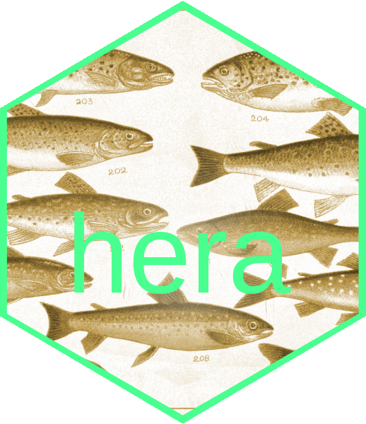
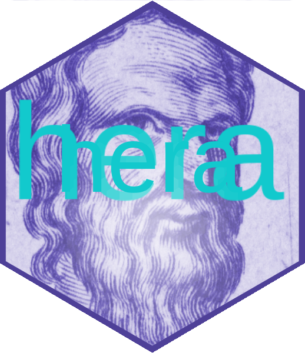
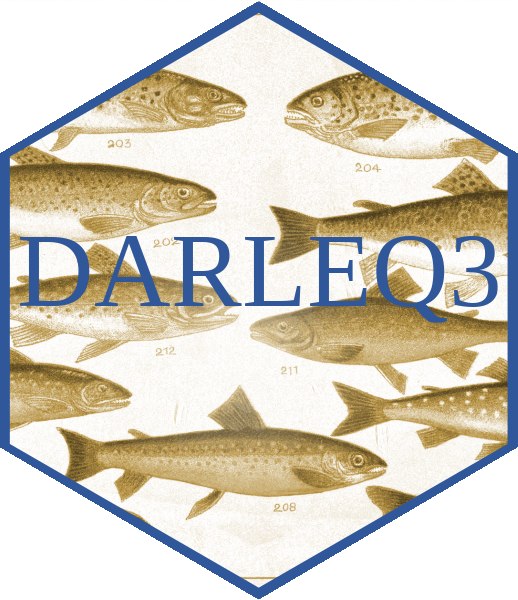

```{r setup, include=FALSE}
knitr::opts_chunk$set(echo = TRUE)
library(hera)
library(tidyverse)
library(kableExtra)
```

<div id="carouselExampleControls" class="carousel slide" data-bs-ride="carousel">
  <div class="carousel-inner">
    <div class="carousel-item active">
      
    </div>
    <div class="carousel-item">
      
    </div>
    <div class="carousel-item">
      
    </div>
  </div>
  <button class="carousel-control-prev" type="button" data-bs-target="#carouselExampleControls" data-bs-slide="prev">
    <span class="carousel-control-prev-icon" aria-hidden="true"></span>
    <span class="visually-hidden">Previous</span>
  </button>
  <button class="carousel-control-next" type="button" data-bs-target="#carouselExampleControls" data-bs-slide="next">
    <span class="carousel-control-next-icon" aria-hidden="true"></span>
    <span class="visually-hidden">Next</span>
  </button>
</div>


## Questions

```{r questions, echo=FALSE}

questions <- catalogue$questions %>% bind_rows() %>% unique()
  kable(questions[, 1:3], format = "html", escape = FALSE) %>% 
      kable_styling(bootstrap_options = c("hover", "condensed")) 

```

## Assessments

Regulatory assessments:

```{r assessments, echo=FALSE}

data <- bind_rows(catalogue$standard)
dt_url <- paste0(gsub(" ", "-", tolower(trimws(data$standard_short))), ".html")
data <- data %>% select(standard_long, status)
data %>% 
  mutate(link = cell_spec(standard_long, "html", link = dt_url)) %>%
  kable(format = "html", escape = FALSE) %>%
  kable_styling(bootstrap_options = c("hover", "condensed")) 
```

## Reports

```{r reports, echo=FALSE}

reports <- catalogue$reports %>% bind_rows() %>% unique()
  kable(reports, format = "html", escape = FALSE) %>% 
      kable_styling(bootstrap_options = c("hover", "condensed")) 

```


