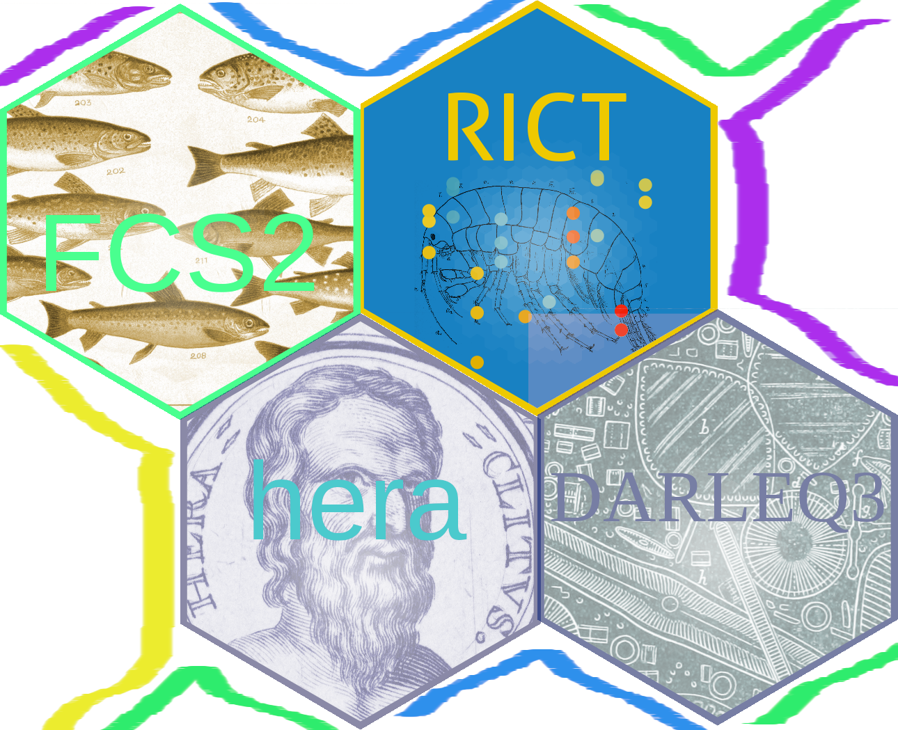

```{r setup, include=FALSE}
knitr::opts_chunk$set(echo = FALSE)
knitr::opts_chunk$set(comment = "")
knitr::opts_chunk$set(warning = FALSE)
knitr::opts_chunk$set(message = FALSE)
knitr::opts_chunk$set(collapse = TRUE)
options(cli.num_colors = 1) # bug? https://community.rstudio.com/t/glimpse-output-encoding-issue-with-pkgdown/117526/4

library(tidyr)
library(dplyr)
library(purrr)
library(hera)
library(darleq3)
library(rict)
set.seed(42)

```

```{r results="asis", echo=FALSE}
# directly adding css to output html without ruining css style https://stackoverflow.com/questions/29291633/adding-custom-css-tags-to-an-rmarkdown-html-document
cat("
<style>
img {
border: 0px;
outline: 0 ;
}
</style>
")
```
WORK IN PROGRESS - Drafting

{ width=50% }

WARNING: Blue sky thinking ahead

Keywords: collection, modelling, prediction, classification, forecast, assessment, scenario

> **TL:DR - To get a flavour of running multiple classification tools using a shared**
> **interface and data structures - check out the [hera demo website GUI](https://ecodata.shinyapps.io/heraapp/)**

# Summary

We propose regulatory tools share a common set of design principles, interfaces
and data structures.

Specifically, we propose an official collection of R packages designed to
provide collaborative workflow for building and using assessment tools. In
turn, these packages will be unified into a single package called 'hera'.
This provides a common interface to run regulatory assessments. We expect
this process will facilitate code re-use, faster integration and knowledge
exchange between method developers and practitioners.

# Motivation

UKTAG has guided the development of an impressive range of classification tools.
This has involved many developers, researchers and experts dedicating their time
and effort to creating tools to better understand pressures on the environment.
We are confident that there are many future opportunities for collaboration and
tool development in response to changing environmental pressures and improving
scientific understanding. As access to modelling tools become more routine, we
expect a proliferation of models and indices in the years ahead. For instance,
new tools for diagnosing pressures, updates to existing tools and catchment
scale planning. To aid better understanding of the environment through
effectively combining multiple models and tools, we propose they share a
common design philosophy to aid integration and collaboration.

# Key Ideas

The aims of a shared design philosophy for regulatory classification R packages
include:
  
- Create a single user interfaces, similar data formats and operating procedures.
- Allow outputs from multiple tools to be quickly generated and combined together.
- Shorten the time between development and integration into Agencies systems.
- Clearer path for researcher engagement and model development.
- Make it easier to share and re-use code between tools for common functions.
- Share data quality standards and data validation code. 
- Apply similar approaches to code review, testing and documentation.

## Preparing for future

In the next 10 years...
  
We assume it is likely that our aquatic ecological models will be subsumed into
a more large scale environmental and climate models. These 'total environment'
models may for instance use climate change models to forecast impact on
invertebrates, water-use models to predict the impact on fish or spatial
planning tools the impact on nutrient levels. The outputs will be used across
regulatory reporting for RBMP, flood management, biodiversity improvements,
carbon sequestering etc. Allowing multi-discipline assessment of impacts and
trade-offs for each planning scenario and proposed measures - ensuring
well-informed decisions-making.

All ecological data along with supporting data such as chemistry, climate,
meteorological, geological, and satellite imagery, will be freely and easily
accessible. We assume agencies will upload all data such as fish counter data,
plant DNA or aerial imagery etc, into a 'lake' of environmental data.

To take step towards this vision, the underlying design of a models and tools
must be modular and easy to connect and integrate in a variety of ways.

# Detailed Design

To aid collaboration and respond to the changing environmentally pressures,
we propose creating a joint collections of packages to share understanding on
the environment while providing the software infrastructure to lighten the
burden of more mundane tasks involved in maintaining and deploying new models
and interfaces.

This proposal is influenced by the work within the climate change research
community such as the [Climate Modelling and Diagnostics
Toolkit](https://climt.readthedocs.io/en/latest/index.html), the MET office's
[unified
model](https://www.metoffice.gov.uk/research/approach/modelling-systems/unified-model/index)
approach. As well as best software practices such as on-going work in the R
community such as [ropenSci](https://ropensci.org/) and research projects such
as the [Virtual
Observatory](https://research-information.bris.ac.uk/ws/portalfiles/portal/63598981/evo_final_report_2014.pdf).

## Shared Packages

Currently we have a number of classification tool R packages shared on github:
  
1. [darleq3](https://github.com/nsj3/darleq3) - Phytobenthos  
2. [fsc2](https://github.com/aquaMetrics/fcs2) - Scottish river fish  
3. [rict](https://github.com/aquaMetrics/rict) - General invertebrate classification  
  
We propose these tools become part of official collection of packages and
we work towards making them inter-operable via the `hera` package.

## Key Steps

Here we introduce a prototype R package called
[hera](https://github.com/ecodata1/hera). The key idea, is `hera` provides a
common interface for existing WFD packages and future developments. This is
achieved through a set of shared functions required to run and report
classification. It builds on the best practice idea of how to [run many
models](https://r4ds.had.co.nz/many-models.html) simultaneously in R while
keeping the input and output data formats simple and homogeneous. We explain
each function in detail below. In summary, each step represents a function
within the hera package. This allows the re-use code and rules between existing
and future tool development.

**Steps**

**1. Validation**
**2. Indices/metrics**
**3. Assessment**
**4. Reporting**

The examples below illustrative of how this RFC could be implemented. 
Keep in mind these **examples are not full, complete or accurate**. The data structure, naming and details could all change, they are presented as a rough draft.

### Validation

1. Firstly, sense-check the predictor and observation data is with expect limits and formatting rules.
2. Additionally, validation could check the data is within the expect parameter space based on
training data used to create the classification model.

The `validation()` function will returns the passing data and list of warnings/fails.

```{r, echo=TRUE, warning=F, message=F}
# install.packages("devtools")
# devtools::install_github("ecodata1/hera")
demo_data <- hera::demo_data
data <- validation(demo_data) 
data[5, ]
```

### Assess

Using the  `assess()` function, we can calculate as required:
**1. Indices/Metrics (summary stats)**
**2. Predictions (output from models)**
**3. Classification/Reports (assessments combining summary and prediction stats)**

The 'assessment' stage includes any type of index, test or categorisation of our data. This could be WFD classification, compliance check, bathing water or discharge assessment. Broadly, any type of grading or assessment.
  
By default the `assess()` function we run all the assessments possible based on the data provided.

```{r, echo=TRUE, warning=F, message=F}
data %>% 
  assess() %>%
  select(sample_id, question, response) %>%
  slice_sample(n = 4) 

```

Alternatively, we can select a list of specific assessments from the `catalogue` to run as required.

```{r}
catalogue$assessment[1:2]
```

```{r, echo=TRUE, warning=F, message=F}
data %>% 
  assess(name = catalogue$assessment[1:2]) %>%
  select(sample_id, question, response) %>%
  slice_sample(n = 4) 

```

#### Assessment Reports

The `catalogue` can contain complex reporting assessments that compile, group
and presents one or more assessment output. For instance running and presenting
a number of WFD assessments, grouping by water body and hierarchy for a River
Basin Management Plan.

```
# TODO!
assess(demo_data, 'rbmp_report') 

```

#### Diagnosis

As well as classification of water quality, additional we need to diagnose
potential pressures. Again, we can add a assessment to the `catalogue` for
diagnostic reporting. We use the `assess()` function to build a custom report to
help diagnose potential pressures.

```
# TODO!
assess(demo_data, 'diagnose_wfd_pressures') %>% 
select(sample_id, question, response)
head()

```

#### Aggegation

To facilitate general data exploration, an `aggregate` helper function can group the outputs by season, year, multi-year or water body as
required. This allows a standard way to aggregate data within the `hera` toolset.

```
aggregate <- aggregate(demo_data, c("year","season","waterbody"))
head(class)

```
#### Compare

A `compare` helper function allows generic comparison between years, locations or samples to allow general data analysis and comparison. 

```
# TODO!
compare_report <- compare(new_data, old_data)
compare_report

```
Another, example of comparing two samples (perhaps up and downstream):

```
# TODO!
compare_report <- compare(site_one, site_two)
compare_report

```
#### Scenarios

A number of forecasting or scenario tools could be incorporated for either projecting current trends or assessing the impact of proposed measures. 

```
# TODO!
assess(demo_data, trends, scenario="wfd_forecast") %>%  
head()

assess(demo_data, measures, scenario="measure_impact") %>% 
head()

```

### The Whole Game

For the most part we don't expect users to go through each of these steps. But
for developers and researchers it is useful to think about classification within
this framework of discrete steps. For the majority of end users, agency staff or
consultants, they can open the GUI `hera_app()` or visit the website directly.
However, advanced users can use the `hera` function to wrap all these steps
together for example `hera(hera::demo_data)`.
  
Furthermore, agencies can integrate these functions into their systems using web
services. Please see the [demo web
service](https://cloud.opencpu.org/ocpu/apps/ecodata1/hera/info) and [api
documentation](https://www.opencpu.org/api.html) for using
[opencpu](https://www.opencpu.org/) hosted packages.

## Lots of Datasets - one underlying data structure?

Models rely on observed sampling for training. Samples come in a range of forms
from points, transects, images, grabs, DNA etc. But the general feature of
modelling is based on being able to predict what we expect to find from whatever
sampling technique we deploy. The sample is the fundamental observation which we
compare against our prediction. The samples are discreet, either observed
instantaneously or perhaps over a few minutes or hours (where dynamic changes
are not significant).
  
Multiple samples can be aggregated to smooth variance but the sample still
remains the fundamental building block. The sample could be a single pixel from
an aerial image or a salmon moving through a fish counter. We still make
predictions of what we expect this sample to be like even if the true picture
only emerges after several samples are aggregated or compared.

Therefore, all our data share similarities, they consist of samples and
observations. And additionally each sample will have predictor variables to
allow us to predict expected reference values or outcomes.

### Data dictionary

There are a number of data dictionaries, [metadata standards](https://en.wikipedia.org/wiki/Metadata_standard) and [semantic data](https://en.wikipedia.org/wiki/Semantic_Web)
definition across disciplines and organisations. It's unclear exactly how we
define our input and output datasets. Therefore, we propose using common
definition and standards where possible. In a similar way to the climate model
communities use of the [Climate and Forecast Standard
Names](http://cfconventions.org/index.html).

The Europe Environment Agency has produced a [data dictionary for reporting](https://dd.eionet.europa.eu/).
However, this is mainly for high-level reporting. In particular, taxonomic
results are not exchanged using this data structure. However, we use some
aspects of this standard within hera to aid onward reporting to EEA.

### What does this look like?

A small sample demo dataset `demo_data` contains diatoms, macrophytes and
inverts quality elements.

```{r}
hera::demo_data %>%  
  select(location_description, date_taken, sample_id, quality_element) %>% 
  group_by(quality_element) %>% 
  slice_sample() %>% 
  head(5)
  
```

### Book-keeping variables

First of all, we have 'book-keeping' variables. These allow us to reference data
associated with particular samples, locations or WFD methods. And allow results
to be aggregate at different levels.

```{r}
hera::demo_data %>% select(location_id, sample_id, date_taken, quality_element) %>% 
  head(5)

```

All data passed into hera must have these four variables. For *ad hoc*
reporting, consultancies and students etc who don't routinely record unique
sample ids, a sample_id is generate if `date_taken` and `location_id` are
provided.
  
These three variables are the minimal required, but in practice `water_body_id`
maybe required for aggregation or simply `location_description` or `NGR` etc to
help reference sites more easily. There is no restriction to the number of extra
columns and these extra columns will be appended to outputs.

### Observations

An observation consists of three variables `question`, `response`. The
`question` variable identifies what is being determined such as `alkalinity`
or `depth` etc. And the `response` is the value observed or recorded for that
question.

Below is an example of diatom records, invert data and river flow in a shared
input format.

```{r}
demo_data %>% select(question, response)

```
  
In theory, this is all that is required. However for ease for interacting with
existing datasets and *ad hoc* data, a third column `label` is useful due to the historic way taxon data is usually stored.

```{r}
demo_data %>% select(question, response, label) %>% 
  slice_sample(n = 5)

```

### Predictors

Predictive variables such as `temperature`, `altitude`, `slope` are added as
additional columns. There is a trade-off here as predictor variables are added
for each row in the dataset, increasing the size of the dataset. However this
does make data analysis straightforward and this repeated data can be easily
compressed if size becomes an issue. For instance, nested JSON data or
dataframes in R.

```{r}
demo_data %>%  select(`mean_alkalinity`, `grid_reference`, `slope`)
```

### Assessments

The outputs are all presented in a consistent format making
outputs from different models instantly comparable and portable.

## Data Input

For students and consultancies requiring *ad hoc* usage, templates and
documentation for preparing data will be provided.
  
For Agencies, data queries can be written to prepare outputs in the correct
format.
  
For instance, here is a prototype function to pull data Environment Agency's
data.gov.uk web service and convert to the required `hera` input format.

```r
environment_agency_data <- hera:::get_data(location_id = c(43378, 92751))
tibble(environment_agency_data)
```

We can then run this EA data through `hera`:

```r
report <- hera::assess(environment_agency_data)
report %>%
  select(date_taken, question, response) %>%
  unique()
```

## Shared Data Tables 

Following data tables are shared through `hera`...

* Validation Rules
* Indices, Model and Environmental Standards
* Taxon Table
* EQR / assessment / compliance boundaries
* Parameter Hierarchy

### Models and Environmental Standards names

```{r echo=TRUE, warning=F}
hera::catalogue
```

## Model platform

This RFC is mainly looking at a share design for inputs and outputs from
classification tools.

This framework does however encourage a shared principles in thinking about the
approach to modelling required which drives the classification method. However,
we see no need to prescribe a modelling program or software. Researchers can
download the reference and predictor data required and use any software they
desire. Ultimately, the model we need to be called by R. So either the model
needs to be written into R or in language which can be called by R (Python,
fortran, C++ etc).

Alternatively, if researchers can't provide an api for R to call, the
recommendation is to use R - which integrates more directly into the pipeline.

Once modelling is completed, the model object is saved and deployed. Any
existing or future data collected using the platform will be run through the
model at the sample level.
  
Researchers can then build tools to display and aggregate the sample level
results as required (Waterbody, Year, Catchment etc). Where it would be possible
to share techniques for producing Confidence of Class, assessment of data
suitability and adjustment factors etc.

# How We Teach This

As new regulatory developments and updates requirements are identified, the lead
contacts from the agencies and method developers are 'on-boarded' to demonstrate
the design principles and collaborative framework of packages. Where skill
development is required further training can be provided, or additional external
or internal support from the agency commissioning the work.
  
A workshop for lead data experts / R coders from each agency delivers
institutional knowledge on how internally developed tools will fit with the
shared design philosophy as well as setting expectations for collaboration with
external researchers.

## Sharing

Hera allows multiple ecological elements to be assessed through the same
interface. But not just the interface is shared. Other areas of the
infrastructure are shared including:

- Reporting and comparison tools can also be shared between multiple
elements. 
- Validation checks and other universally required mechanisms
are shared and easily configurable for new models/methods.
- Testing infrastructure. 
- Confidence of class and data suitability algorithms. 

## Organisation

All UKTAG sub-groups and their nominated leads in the devolved agencies would
contribute new method develops and tools to the shared collection of packages.
Where tools are agency specific, these could also make use of the platform if
required.

As agencies commission new tools to be developed, researchers can upload their
predictive variables, reference data and models into a central repo for easier
collaboration.


# Alternatives

1. Status Quo - Future development takes the form of bespoke, custom code in
self-contained R packages or Excel spreadsheets. No code re-use, collaboration
or consistency against tools/metrics/assessments.

2. Other computational document standards such as Python Julia, JS based Jupiter
or Quarto documents. Currently, most of our code is either Excel or R based. We
wish to avoid re-writing R code into other languages. But this doesn't preclude
future developments using other languages or computational document standards.

3. Web assembly - Compile our R, Python, Julia, C++ etc into widely supported
Web Assembly language for fast use within web browser (on or offline). This is
only at a prototype stage in R and Python and many existing libraries cannot
compile to Web Assembly. Possibly in future this may be an option. But current
tools for integrating and combining languages provide broad enough
consistency/compatibility even if a back-end server is required. Requiring a
back-end server can impact offline or native usage in some situations such on
mobile devices. For instance, R only supports MacOS, Linux and Windows. R isn't
officially supported to run locally/natively on Android or iOS. On these
devices, R must run in a web server and requires mobile/wifi signal to
communicate with the device. Using Web Assembly in future may avoid the need for
web-server for mobile / offline devices.

# Unresolved Questions

- Should all reference/predictor data be combined into a single repository / web service?

# Appendix


## List of Current Data Structures in R packages

### FCS2 tool 

Demo input data format (truncated) and full list of column names
```
 DataHeldBy SiteCode Alternative.site.code Repeat.check SiteName
1         EA   525052                    NA            N    13809
2         EA   507441                    NA            Y    13810
3         EA   525051                    NA            N    34611
4         EA   122881                    NA            Y     5435
  Site.description ...
1            13809 ...
2            13810 ...
3            34611 ...
4             5435 ...
 [1] #DataHeldBy#                 #SiteCode#                  
 [3] #Alternative.site.code#      #Repeat.check#              
 [5] #SiteName#                   #Site.description#          
 [7] #Easting#                    #Northing#                  
 [9] #NGR#                        #SurveyDate#                
[11] #WBId#                       #WBName#                    
[13] #NumberOfRuns#               #SurveyArea#                
[15] #WetWidth#                   #Slope#                     
[17] #BarrierType#                #ImpassableBarriers#        
[19] #Sense.check.passed.#        #CatchmentAreaUpstream#     
[21] #CatchmentDrainageDirection# #GeologyClass#              
[23] #Altitude#                   #DistanceFromSource#        
[25] #DistanceToSea#              #AnnualMeanFlow#            
[27] #AlkalinityValue#            #TotalPValue#               
[29] #DOCValue#                   #SuspendedSolidsValue#      
[31] #IOH.hydrometric.area#       #HydrometricAreaNo#         
[33] #LandUse.AgriculturalAreas#  #LandUse.ConiferousForests# 
[35] #LandUse.Wetlands#           #Substrate.Small#           
[37] #Substrate.Large#            #Substrate.Bedrock#         
[39] #Salmon_fry.Run1Total#       #Salmon_fry.Run2Total#      
[41] #Salmon_fry.Run3Total#       #Salmon_fry.Run4Total#      
[43] #Salmon_parr.Run1Total#      #Salmon_parr.Run2Total#     
[45] #Salmon_parr.Run3Total#      #Salmon_parr.Run4Total#     
[47] #Trout_fry.Run1Total#        #Trout_fry.Run2Total#       
[49] #Trout_fry.Run3Total#        #Trout_fry.Run4Total#       
[51] #Trout_parr.Run1Total#       #Trout_parr.Run2Total#      
[53] #Trout_parr.Run3Total#       #Trout_parr.Run4Total# 
```

Ouput

```
WBName ...
1         EA 03/09/2015   525052    13809 10675                          ...
2         EA 04/09/2015   507441    13810 10675 White Esk (u/s Rae Burn) ...
3         EA 03/09/2015   525051    34611 10676                          ...
4         EA 01/09/2015   122881     5435 10676            Garwald Water ...
 [1] #DataHeldBy#                                 
 [2] #SurveyDate#                                 
 [3] #SiteCode#                                   
 [4] #SiteName#                                   
 [5] #WBId#                                       
 [6] #WBName#                                     
 [7] #All species WB EQR Bad %#                   
 [8] #All species WB EQR Poor %#                  
 [9] #All species WB EQR Moderate %#              
[10] #All species WB EQR Good %#                  
[11] #All species WB EQR High %#                  
[12] #All species WB EQR mean#                    
[13] #All species survey EQR Bad %#               
[14] #All species survey EQR Poor %#              
[15] #All species survey EQR Moderate %#          
[16] #All species survey EQR Good %#              
[17] #All species survey EQR High %#              
[18] #All species survey EQR mean#                
[19] #Salmon_fry WB EQR mean#                     
[20] #Salmon_fry survey EQR mean#                 
[21] #Salmon_fry observed total catch#            
[22] #Salmon_fry probability present#             
[23] #Salmon_fry expected total catch if present# 
[24] #Salmon_fry expected total catch#            
[25] #Salmon_parr WB EQR mean#                    
[26] #Salmon_parr survey EQR mean#                
[27] #Salmon_parr observed total catch#           
[28] #Salmon_parr probability present#            
[29] #Salmon_parr expected total catch if present#
[30] #Salmon_parr expected total catch#           
[31] #Trout_fry WB EQR mean#                      
[32] #Trout_fry survey EQR mean#                  
[33] #Trout_fry observed total catch#             
[34] #Trout_fry probability present#              
[35] #Trout_fry expected total catch if present#  
[36] #Trout_fry expected total catch#             
[37] #Trout_parr WB EQR mean#                     
[38] #Trout_parr survey EQR mean#                 
[39] #Trout_parr observed total catch#            
[40] #Trout_parr probability present#             
[41] #Trout_parr expected total catch if present# 
[42] #Trout_parr expected total catch#      
```
### Darleq Tool

Input data for DARLEQ3 tool is a list of dataframes. Here's an example of input
data format (truncated) and full list of column names

```{r}

file <- system.file("extdata/DARLEQ2TestData.xlsx", package="darleq3")
data <- read_DARLEQ(file, "Rivers TDI Test Data")
test <- data$diatom_data[1:4, 1:8]
test$... <- "..."
test
names(data$diatom_data)
names(data$header)
```

Output
(list of dataframes)

```{r}
fn <- system.file("extdata/DARLEQ2TestData.xlsx", package="darleq3")
d <- read_DARLEQ(fn, "Rivers TDI Test Data")
results <- calc_Metric_EQR(d, metrics=c("TDI4", "TDI5LM"))
head(results$TDI5LM$EQR[, 9:13])
head(results$TDI5LM$Uncertainty[, 9:13])
head(results$TDI5LM$Metric)
head(results$TDI5LM$Job_Summary, 4)
```


### RICT

Here's an example of input data format (truncated) and full list of column names

```{r}
test <- rict::demo_observed_values[1:4, 1:8]
test$... <- "..."
test
names(demo_observed_values)
```

Output

```{r, warning=F, message=F}
test <- rict(demo_ni_observed_values)
example <- head(test[1: 6], 4)
example$... <- "..."
example
names(test)
```


